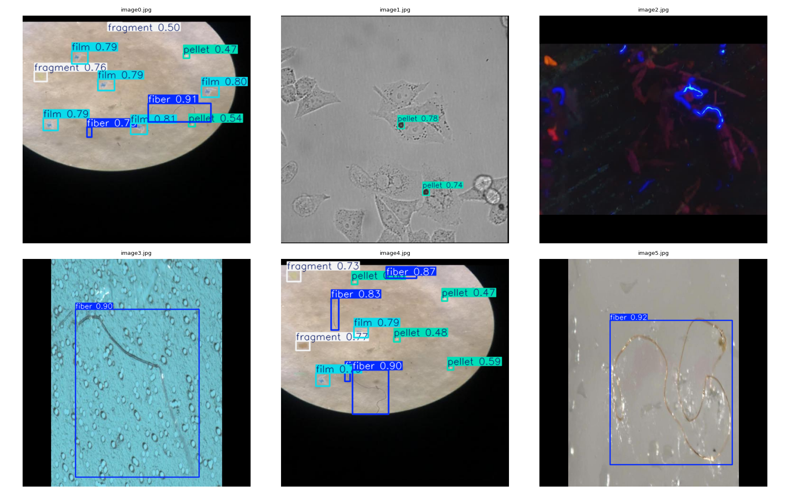
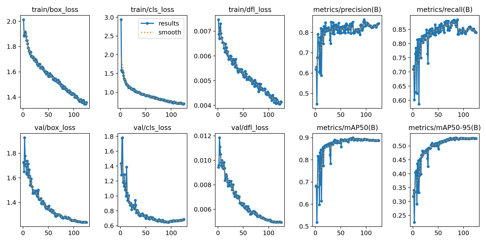
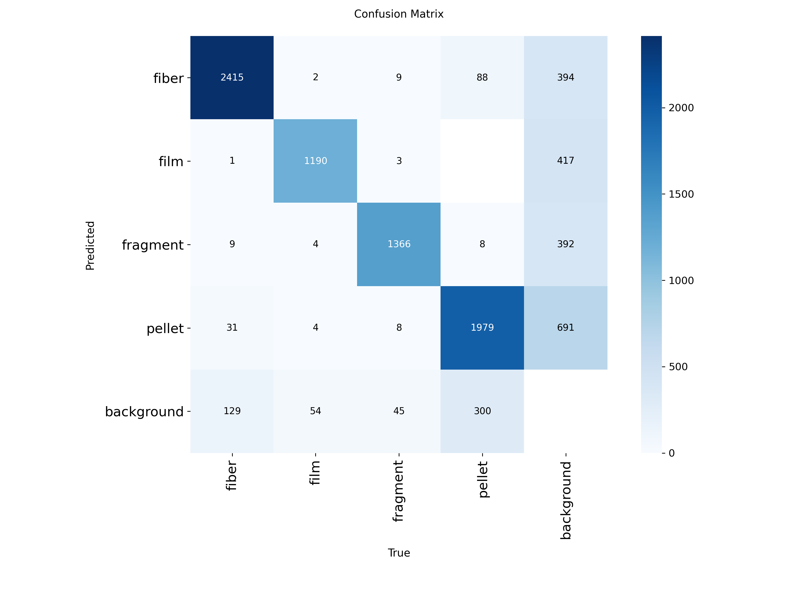

# 🔬 AI-Based Microplastic Detection System

Deep-learning system that **detects and classifies microplastic particles** in microscopy imagery into four morphological types — **fiber, film, fragment, pellet** — using a custom-trained [Ultralytics **YOLO26**](https://docs.ultralytics.com/models/yolo26/) object detector, served through **PlastiScope**, an instrument-style web app.


Built end-to-end: **sourcing & cleaning datasets → labeling in-house lab data → harmonizing labels → training on Kaggle GPUs → evaluation → ONNX export → a full detection web app.**

<p align="center">
  <br>
  <em>YOLO26m predictions on held-out test micrographs (fiber · film · fragment · pellet)</em>
</p>

---

## 📊 Results — held-out test set (582 images, 3,804 objects)

Model: **YOLO26m** (20.4 M params, 67.9 GFLOPs). Trained 150 epochs on Kaggle **GPU T4 ×2** (DDP) with strengthened augmentation and cosine-LR.

| Class | AP@50 | Precision | Recall | mAP@50-95 |
|----------|:-----:|:---------:|:------:|:---------:|
| fiber    | 0.938 | 0.890 | 0.907 | 0.681 |
| film     | **0.958** | 0.877 | 0.837 | 0.552 |
| fragment | 0.924 | 0.901 | 0.915 | 0.503 |
| pellet   | 0.762 | 0.793 | 0.743 | 0.343 |
| **all**  | **0.895** | 0.865 | 0.850 | **0.520** |

**Headline: mAP@50 = 0.895** on a test set that includes real in-house lab micrographs — the model holds strong accuracy while generalizing across two microscopy modalities. `pellet` (the merged rounded/spherical class) remains the hardest morphology.

<p align="center">
  
  
</p>

---

## 🗂️ Dataset

**9,238 images · ~58,950 labeled boxes · 4 classes.** Full write-up: [`docs/DATASET_REPORT.md`](docs/DATASET_REPORT.md).

The dataset is built around an **originally-collected in-house set prepared at the Micro & Nano (MINA) Laboratory, University of Dhaka** — 290 brightfield micrographs imaged under a microscope and hand-annotated by the author. This is combined with **four openly-shared community datasets** (Roboflow Universe) spanning brightfield + fluorescence microscopy.

| Split | Images | of which MINA lab |
|-------|:------:|:-----------------:|
| train | 7,524 | 232 |
| valid | 1,132 | 29 |
| test  | 582 | 29 |

Key data-engineering decisions:
- **Unified 4-class morphological taxonomy** (GESAMP standard). Every source already shared the same class indices → the merge required **zero label-file remapping**.
- **MINA lab data** merged with an 80/10/10 split and a `lab_` filename prefix, so lab-domain performance can be measured on its own.
- **Deduplication + split-leak removal** (MD5, incl. lab-vs-community cross-check — 0 leaks).
- **Integrity audited**: 0 corrupt images, 0 orphans, 0 out-of-range boxes.

> The raw images are not committed (size). `data/data.yaml` holds the class map; the report documents provenance and how to rebuild.

---

## 🖥️ PlastiScope — the web app

An instrument-style interface (in [`webapp/`](webapp/)): drop a micrograph onto the microscope "stage" (or paste from clipboard / load a bundled sample) and get annotated detections, per-class particle counts, a **live confidence-threshold slider** (re-filters instantly), per-class visibility toggles, and one-click export to annotated image / CSV / JSON.

The backend is deliberately lean — **FastAPI + ONNX Runtime, no PyTorch needed**. Because YOLO26 is NMS-free, the ONNX graph already outputs final decoded boxes, so the server just letterboxes, runs the model, and rescales (~260 ms/image on CPU with YOLO26m).

```bash
pip install -r requirements.txt
cd webapp
uvicorn server:app --host 127.0.0.1 --port 8000
# open http://127.0.0.1:8000
```

API: `POST /api/detect` (multipart image → JSON detections) · `GET /api/health` · interactive docs at `/api/docs`.

---

## 🚀 Quick start — Python inference

```bash
pip install ultralytics          # only needed for the PyTorch path
```
```python
from ultralytics import YOLO

model = YOLO("models/microplastic_yolo26m_best.pt")
results = model.predict("your_image.jpg", conf=0.25, imgsz=640)

for b in results[0].boxes:
    cls  = results[0].names[int(b.cls)]      # fiber | film | fragment | pellet
    conf = float(b.conf)
    x1, y1, x2, y2 = b.xyxy[0].tolist()
    print(f"{cls}  {conf:.2f}  [{x1:.0f},{y1:.0f},{x2:.0f},{y2:.0f}]")
```

For portable / browser deployment use `models/microplastic_yolo26m.onnx` (NMS-free → decoded boxes straight out; runs under `onnxruntime` or `onnxruntime-web`).

---

## 📁 Repository structure

```
AI-Based-Microplastic-Detection-System/
├── data/
│   └── data.yaml                         # class map / dataset config
├── models/
│   ├── microplastic_yolo26m.onnx         # web-ready model (used by the app)
│   └── microplastic_yolo26m_best.pt      # PyTorch weights
├── webapp/
│   ├── server.py                         # FastAPI + ONNX Runtime service
│   └── static/                           # instrument-style frontend + samples
├── notebooks/
│   └── microplastic_yolo26_kaggle_training.ipynb   # full training pipeline
├── results/                              # metrics, curves, confusion matrix, sample preds
├── docs/
│   ├── DATASET_REPORT.md                 # dataset build & decisions
│   └── KAGGLE_TRAINING_GUIDE.md          # step-by-step training on Kaggle
├── tools/
│   └── download_trained_model.py         # fetch the model from Kaggle to models/
├── requirements.txt · LICENSE · README.md
```

---

## 🏋️ Reproduce the training

Full instructions: [`docs/KAGGLE_TRAINING_GUIDE.md`](docs/KAGGLE_TRAINING_GUIDE.md). In short:
1. Upload `microplastic_yolo26_training_dataset.zip` as a Kaggle Dataset.
2. Import `notebooks/microplastic_yolo26_kaggle_training.ipynb`.
3. Accelerator **GPU T4 ×2**, Internet **On**, attach the dataset.
4. **Save & Run All (Commit)** → trains, validates on test, exports `.pt` + `.onnx`, and auto-saves the model to a Kaggle Dataset.

Config (YOLO26m, 640 px, batch 32, DDP, cosine-LR, strengthened augmentation) lives in one editable cell, validated against the [official YOLO26 training recipe](https://docs.ultralytics.com/guides/yolo26-training-recipe/).

---

## 🧭 Roadmap
- [x] Dataset sourcing, cleaning, unification & audit
- [x] In-house MINA lab dataset labeled & merged
- [x] YOLO26m training on Kaggle GPUs + evaluation
- [x] Model export (PyTorch + ONNX)
- [x] **PlastiScope detection web app**
- [ ] Public deployment (hosted demo)

---

## 🙏 Acknowledgements
Primary data collected at the **Micro & Nano (MINA) Laboratory, University of Dhaka.** Additional coverage from community datasets on **Roboflow Universe** (`microplastic-detection-fcg6y`, `microplastic-final-kpdl3`, `microplastic-6piy9`, `microplastic-nuga5`). Built with [Ultralytics YOLO26](https://github.com/ultralytics/ultralytics).

---

<p align="center"><em>Kh Sadman · Micro & Nano (MINA) Laboratory, University of Dhaka · Computer Vision / Deep Learning</em></p>
